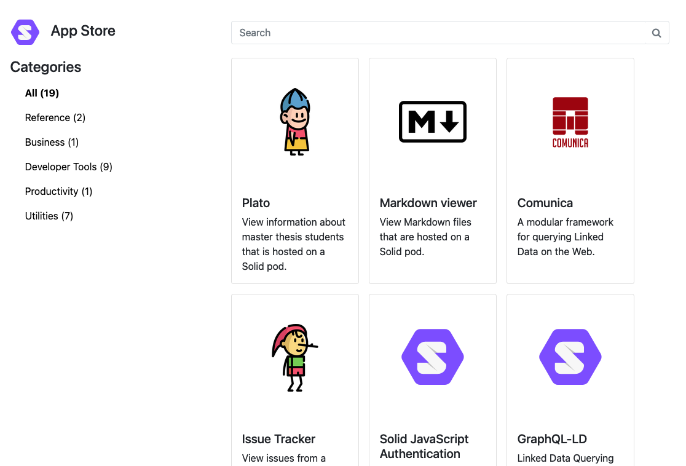

<!--
Fill in the WebIDs of the people below.
Leave this in comments!
It's possible to have multiple people per role.

Challenge/scenario creator:
  - https://id.inrupt.com/jeswr
Solution creator:
  - https://pieterheyvaert.com/#me
Report writer:
  - https://pieterheyvaert.com/#me
-->

# App that lists apps and tooling

The corresponding challenge is [#30](https://github.com/SolidLabResearch/Challenges/issues/30).

## Problem

The goal is for the Solid project to "eat its own dog food" by having an app/interface in which users can see 
which apps and developer tooling exist within the ecosystem.

Concretely:
- There exists an ontology with which apps and tooling are described.
- The data is published and maintained in a sustainable way.
- Developers are incentivied to keep an up-to-date record of their work 
or this can be entirely automated for them by scraping data from wherever they are doing their work such as GitHub, Gitlab, and so on.

In the long term, I would envision this to be an app store for Solid apps and a wiki for developer tooling/sdks.

## Approved solution

We developed a [Web app](https://github.com/KNowledgeOnWebScale/solid-app-store/) that
shows users a lists of apps and libraries.
Users can filter on category and search on the names and descriptions of apps and libraries.
There are also [shapes](https://github.com/KNowledgeOnWebScale/solid-app-store#how-to-add-app-to-store) 
for how information about the apps should be published.
You find a live version of the app [here](https://solid-app-store.netlify.app/).

Below you find a screenshot of the app.

## User flow

### Actors/actresses

- Web app
- User of the application

### Preconditions

None.

### Steps

1. The user opens the Web app.
2. The user searched for "editor".

### Postconditions

- The app shows two apps: "solideditor" and "waceditor".

## Follow-up actions

None.

## Future work

- Users can set their own sources where the app store fetches the information about apps and libraries.
Now this is hard-coded.
