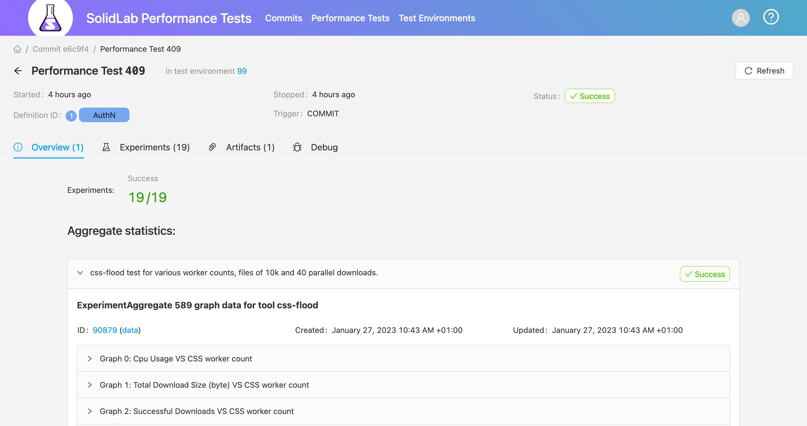

# Automatically test performance of each CSS commit

The corresponding challenge is [#23](https://github.com/SolidLabResearch/Challenges/issues/23).

## Problem
Changes to code of [Community Solid Server](https://github.com/CommunitySolidServer/CommunitySolidServer) (CSS) 
can have an impact on the memory, CPU and even bandwidth usage of the CSS.
It would be nice to know this impact for each commit to the CSS repo, 
to spot performance impact as soon as possible.

## Approved solution
We developed the [SolidLab Performance Test Server](https://github.com/SolidLabResearch/solidlab-perftest-server/).
It offers both a backend and frontend. 
The frontend is available at https://testing.solidlab.be/.
You find a screenshot of it below.
You find more information about 
the architecture [here](https://github.com/SolidLabResearch/solidlab-perftest-server/blob/master/docs/architecture.md). 

## Follow-up actions
- Improving the performance of the server.
- Fixing bugs.

## Future work
- Make the server usable for non-CSS tests.