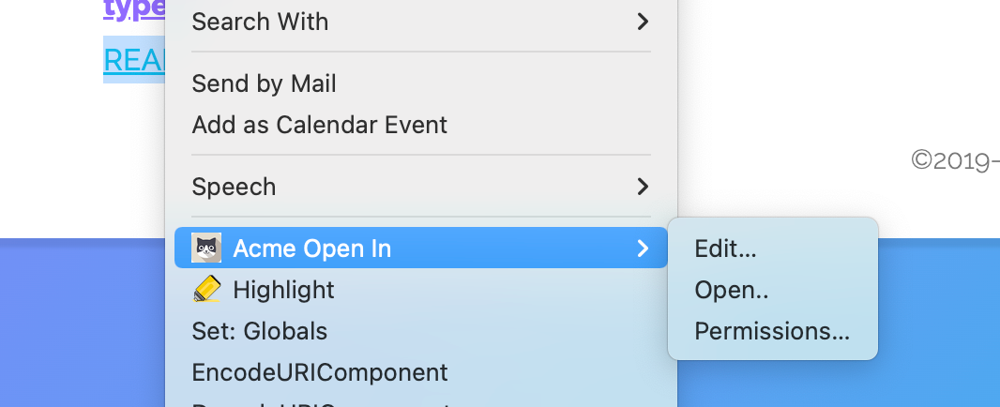

# Browser extension intercepting urls to open resources with user-defined app

The corresponding challenge is [#45](https://github.com/SolidLabResearch/Challenges/issues/45).

## Pitch

In a decentralized Solid world many applications will provide functionality to do one or more specialised actions, 
such as browsing files, playing games, creating a Doodle, participating in a Quiz. 
In this environment users have a preference for apps they want to use to do some tasks:

- When the user wants to browse a pod, she wants to use App X.
- When the user wants to play chess, she wants to use App Y.
- When the user wants to edit a text resource, she wants to use App Z.

This challenge is specific for solving "what to App to use when reading Solid pod `inbox` notifications".
We developed a [browser extension](https://github.com/phochste/AcmePlugin) that 
allows users to open resources with existing Solid apps via the context menu.
You can configure what Web pages and resources are considered by the extension and what specific apps should be used. 
Below you see a screenshot of the context menu that appears when right-clinking on a page
when the plugin is installed.

## Code
You find the code for this extension [here](https://github.com/phochste/AcmePlugin).

## User flow

### Actors/actresses 

- User of the application
- Browser extension

### Preconditions

- User has installed the extension in the browser.

### Steps

- The user visits a Web page that is considered by the extension.
- The user right-clicks on a resource that is considered by the extension.
- The extension opens the corresponding Solid app and loads the resource.

### Postconditions

- The resource is opened in the preferred Solid app based on the extension's configuration.

## Future work

- Advanced functions implementations might consider creating (N3) rules to decide what app to open based on resources/types.