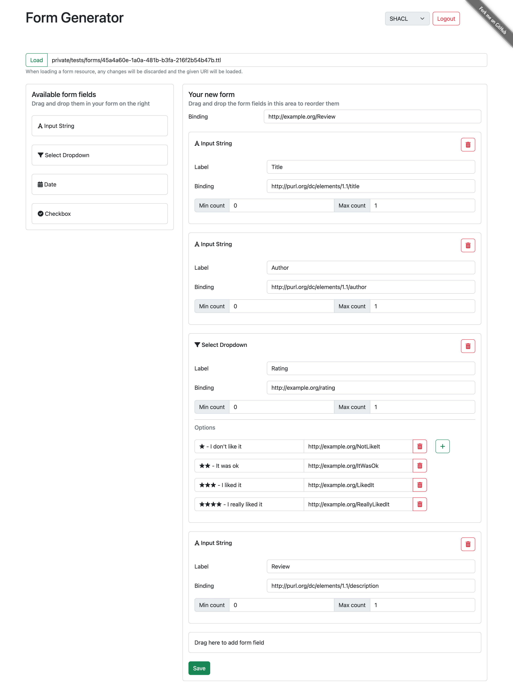

# Drag & drop form builder to build basic RDF form definition

The corresponding challenge is [#64](https://github.com/SolidLabResearch/Challenges/issues/64).

## Problem
Create a drag & drop form builder that combines HTML form input fields, and 
generates an RDF form definition of the created form. 
This RDF form definition should be stored in a preferred Solid location.

The basic idea is to start with a Google Forms-like interface but for the generation of RDF data. 
This application is one application that can be used in an environment in which:

- Form builders can generate an RDF form definition.
- Form renders that can render an RDF form for end users (e.g. as HTML or as a text menu).
- Form viewers that can view the generated RDF in a human friendly way.

These three components can work together, for example, so that 

1. a form builder can create a Doodle form, 
2. a form render can make the HTML version to input the data, and 
3. a form viewer can render a nice read-only view.

## Approved solution
We developed a [Web app](https://github.com/smessie/FormGenerator) 
that allows users to create form definitions and share them with other users. 
The generated form definition is stored in a user's pod as RDF and 
can then be used together with a form renderer to input data.

Below you find a screenshot where a form is defined with the following fields:

- Title: a text field which binds to `dc:title`
- Author: a text field which binds to `dc:author`
- Rating: a dropdown field for which binds to ex:rating. The dropdown should contain these options:
  - "★ - I don't like it" binding to `ex:NotLikeIt`
  - "★★ - It was ok" binding to `ex:ItWasOk`
  - "★★★ - I liked it" binding to `ex:LikedIt`
  - "★★★★ - I really liked it" binding to `ex:ReallyLikedIt`
- Review: a text field which binds to `dc:description`

## User flow

<!--
Describe a concrete user flow with the approved solution.
Complete the following sections:
-->

### Actors/actresses

- Form generator Web app
- User of the Web app

### Preconditions

- The user has a WebID.

### Steps

1. The user opens the Web app.
2. The user logs in with their WebID.
3. The user drags fields from the panel on the left side to the panel on the right.
4. The user fills in the details of the fields. See the example form in the "Approved solution" section.
5. The user click on the button "Save".
6. The app shows a notification confirming that the data is saved at the resource mentioned at the top.

### Postconditions

- The form is stored in the user's pod at the resource mentioned at the top.

## Follow-up actions

None.

## Future work

None.