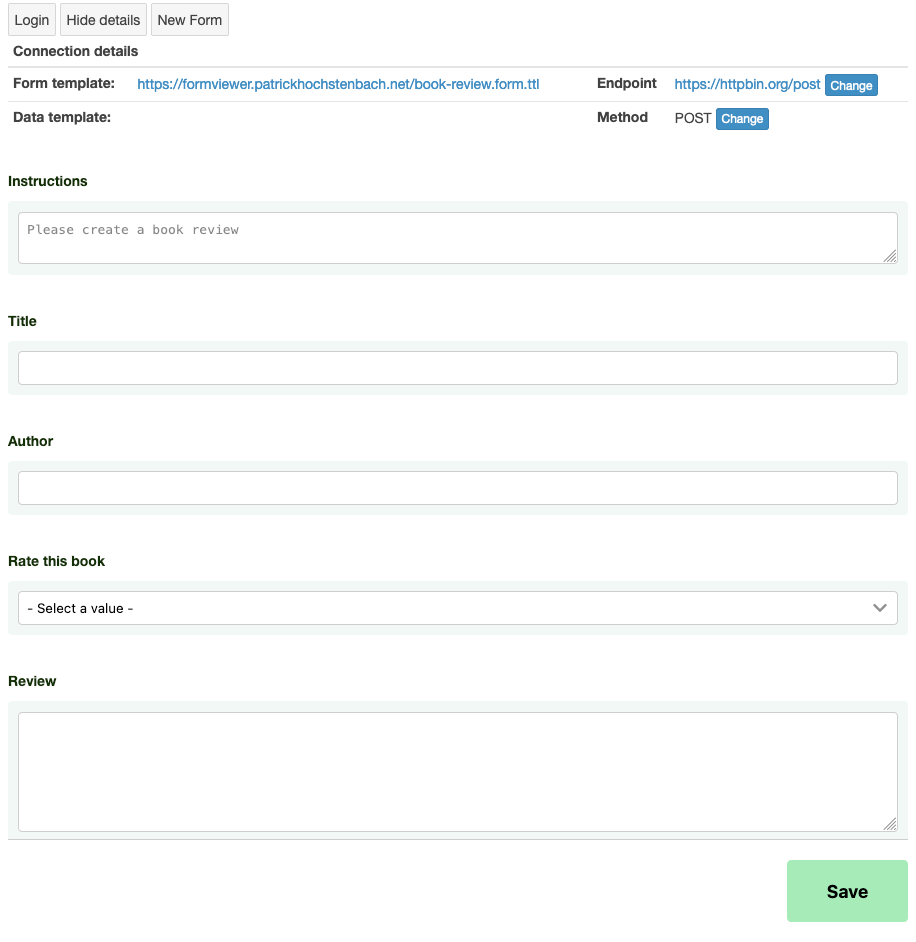

<!--
Fill in the WebIDs of the people below.
Leave this in comments!
It's possible to have multiple people per role.

Challenge/scenario creator:
  - https://patrickhochstenbach.net/profile/card#me
Solution creator:
  - https://patrickhochstenbach.net/profile/card#me
Report writer:
  - https://pieterheyvaert.com/#me
-->

# Form renderer that to view RDF form and store filled-in data in pod

The corresponding challenge is [#65](https://github.com/SolidLabResearch/Challenges/issues/65).

## Problem

Create a form renderer that can render an RDF form definition.
In this application users can in a declarative way point to 

- the RDF form definition, 
- the RDF data, and
- the resource on a Solid pod where the data should be stored.

This application is one application that can be used in an environment in which:

- Form builders can generate an RDF form definition.
- Form renders that can render an RDF form for end users (e.g. as HTML or as a text menu).
- Form viewers that can view the generated RDF in a human friendly way.

These three components can work together, for example, so that

1. a form builder creates a Doodle form,
2. a form renderer makes a HTML version to input the data, and
3. a form viewer generates a nice read-only view.

See also the report ["Drag & drop form builder to build basic RDF form definition"](./drag-drop-form-builder-to-build-basic-rdf-form-definition.md).

## Approved solution

We developed a [Web app](https://github.com/phochste/FormViewer) 
that allows users to

- view an RDF form, and
- fill in the data.

You find a screenshot below for a book review form:

In the screenshot, you see the following components:

- "Login" button: log in with your Solid pod.
- "Show details" button: show details about the form and where the filled-in data is stored.
- "New form" button: load a new form.
- "Instructions" text field:  nstructions related to the form.
- "Title" text field: title of the book review.
- "Author" text field: author of the book.
- "Rate this book" dropdown field: rating you give the book.
- "Review" text field: review of the book.
- "Save" button: save the form.

## User flow

<!--
Describe a concrete user flow with the approved solution.
Complete the following sections:
-->

### Actors/actresses

- Form viewer Web app
- User of the Web app

### Preconditions

None.

### Steps

1. The user opens the Web app at https://formviewer.patrickhochstenbach.net/?rft.form=https%3A%2F%2Fformviewer.patrickhochstenbach.net%2Fbook-review.form.ttl
2. The user fills in the details of the fields. See the example form in the "Approved solution" section.
3. The user click on the button "Save".
4. The app shows a notification confirming that the data is saved at the resource mentioned in the details.
You see the details by clicking on the button "Show details".

### Postconditions

- The filled-in data is stored at the resource mentioned in the details.

## Follow-up actions

None.

## Future work

None.
