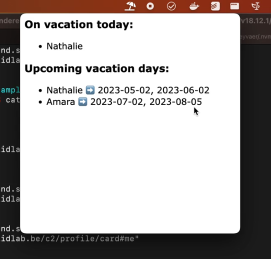

# Menubar app to check who is on vacation

The corresponding challenge is [#92](https://github.com/SolidLabResearch/Challenges/issues/92).

## Problem
<!--
You can reuse the pitch of the challenge, but check if you need to make changes.
For example, it might happen that the approved solution does more than what the original pitch requested.
-->

Manually checking your calendar to quickly see who is on vacation is a hassle. 
It would be easier to have menubar app that shows in a glance who is on vacation today.

## Approved solution
<!--
Provide information about the approved solution:
names of tools/libraries created, repos, and so on.
-->

We developed a [menubar app](https://github.com/SolidLabResearch/solid-menubar-app) that
shows who is when on vacation.
You find a screencast of the app [here](https://cloud.ilabt.imec.be/index.php/s/HEeGsCS4PiQxaS7)
and below you find a screenshot.



We made the following important technological decisions and assumptions:
- We use the Community Solid Server-specific
  [Client Credentials](https://communitysolidserver.github.io/CommunitySolidServer/6.x/usage/client-credentials/)
  to log in and authenticate.
  There is an [ongoing discussion](https://github.com/solid/solid-oidc/issues/75) in
  the [Solid-OIDC](https://solidproject.org/TR/oidc) spec regarding
  the need for something like Client Credentials.
- We use [Electron](https://www.electronjs.org/) because it allows us to reuse existing JavaScript libraries and 
  make the app cross-platform.
- Users have to manually provide the urls of the vacation calendars.
  We didn't include the automatic discovery of this information.
- We assume that the vacation calendar lists the dates via the predicate `https://data.knows.idlab.ugent.be/person/office/#date`.
- We assume that the name in the WebID is provided via the predicate `http://schema.org/name`.

## User flow

<!--
Describe a concrete user flow with the approved solution.
Complete the following sections:
-->

### Actors/actresses

- Menubar app
- User of the application

### Preconditions

- The user has Node.js installed.

### Steps

1. Clone [the repo of the app](https://github.com/SolidLabResearch/solid-menubar-app) via
   ```shell
   git clone https://github.com/SolidLabResearch/solid-menubar-app.git
   ```
2. Install the dependencies via
   ```
   npm i
   ```
3. Navigate to the folder `pod-example-data` via
   ```
   cd pod-example-data
   ```
4. Populate the test pods on the [SolidLab Playground](https://pod.playground.solidlab.be/) via 
   ```shell
   node create-example-pods.js
   ```
5. Go back to the root of the repo via
   ```shell
   cd ..
   ```
6. Copy the example config file that works with the test pods via
   ```shell
   cp pod-example-data/config.json config.json
   ```
7. Start the app via 
   ```shell
   npm start
   ```
8. The app appears in the menubar. The icon is an umbrella on a beach.

### Postconditions

- When you click on the icon,
it shows the vacation days.

## Follow-up actions
<!--
List all concrete follow-up actions that someone has to do.
For example, adding helper code from the solution to Comunica.
-->

- Clarify use of the Community Solid Server-specific 
[Client Credentials](https://communitysolidserver.github.io/CommunitySolidServer/6.x/usage/client-credentials/) in 
the README of the app ([issue](https://github.com/SolidLabResearch/solid-menubar-app/issues/2)).
- The app stores the id and secret used by the Client Credentials in a JSON file on the disk of the user.
Are there suggestions on how to make this safer ([issue](https://github.com/SolidLabResearch/solid-menubar-app/issues/5))?
- Clarify why the app does not use [BashLib](https://github.com/SolidLabResearch/Bashlib/) ([issue](https://github.com/SolidLabResearch/solid-menubar-app/issues/3)).
- Regarding the code to populate the test pods:
  - Investigate if this code should be in a separate library ([issue](https://github.com/SolidLabResearch/solid-menubar-app/issues/4)).
  - Clarify why this code did not use [BashLib](https://github.com/SolidLabResearch/Bashlib/) ([issue](https://github.com/SolidLabResearch/solid-menubar-app/issues/3)).

## Future work
<!--
List ideas for future work.
These ideas don't have to be concrete.
You can create a new challenge/scenario for each idea.
-->

- There is an [ongoing discussion](https://github.com/solid/solid-oidc/issues/75) in 
the [Solid-OIDC](https://solidproject.org/TR/oidc) spec regarding 
the need for something like Client Credentials.
We also have [a challenge](https://github.com/SolidLabResearch/Challenges/issues/13) about that.
- How can the app use Solid-OIDC for authentication instead of Client Credentials ([issue](https://github.com/SolidLabResearch/solid-menubar-app/issues/6))?
That way the app works with all Solid identity providers.
