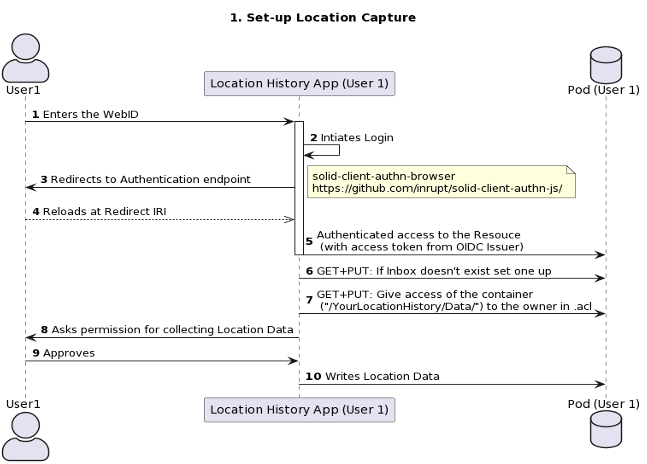
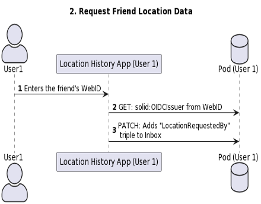
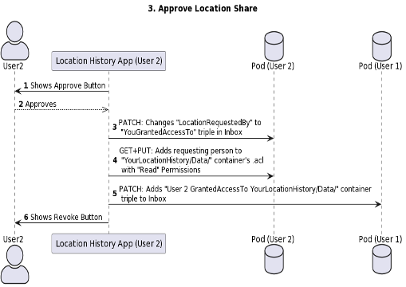
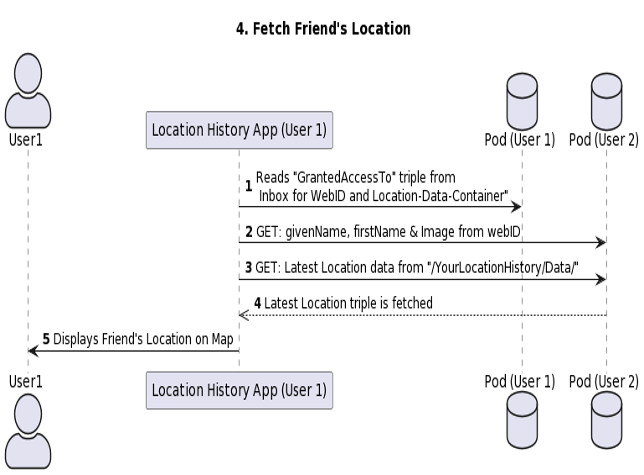
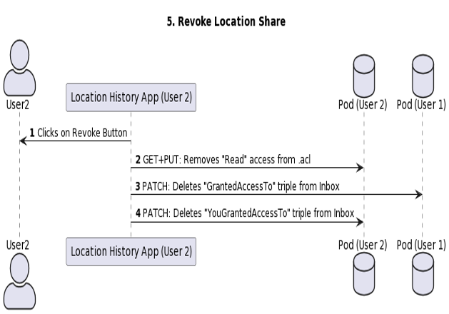

# Store, manage, share and query location (history) data

The corresponding challenge is [#10](https://github.com/SolidLabResearch/Challenges/issues/10).

## Problem
Your location and its history are a valuable source of information for applications to offer you 
a more contextual user experience.

You could for example do the following:

* Share your current location (temporarily) with a friend without sending it to a different server.
* Annotate your location history with the mode of transport you were using at that time. 
This allows to analyse after a certain period your mobility behavior and 
whether using a different mode would’ve saved you time and money 
(like https://savewithcarsharing.be/, but then without manual data entry and with client-side query evaluation).
* Use your location history to check where a certain picture in your pod was taken.
* Look-up when you were at a certain location in the past.

## Approved solution

We developed a [Web app](https://github.com/SolidLabResearch/LocationHistory) that
allow users to capture their location from browser after logging in with their WebID.
The app stores the user's raw location data as RDF which is validated against a SHACL shape. 
The user can also request location from other users using their WebID. 
These requests can be approved or revoked.

You find the live version [here](https://solidlabresearch.github.io/LocationHistory/) and
a screencast of a demo [here](https://cloud.ilabt.imec.be/index.php/s/YbiRfCz7LCSseNy).
The screencast doesn't contain audio.

Below you find sequence diagrams that explain how to

1. Set up location capture
2. Request friend's location
3. Approve location sharing
4. Fetch friend's location
5. Revoke location sharing

## User flow

### Actors/actresses

- Web app
- Two users of the application, called User 1 and User 2.

### Preconditions

- The user has a WebID.

### Steps

1. User 1 opens the Web app.
2. User 1 logs in with their pod.
3. User 1 clicks on the button "Post Location History".
4. The browser asks the user if the app can know the user's location.
5. User 1 clicks on the button "Allow".
6. The app shows a map.
7. The app shows the coordinates of the user's location underneath the map.
8. User 2 opens the Web app.
9. User 2 logs in with their pod.
10. User 2 clicks on the button "Post Location History".
11. The browser asks the user if the app can know the user's location.
12. User 2 clicks on the button "Allow".
13. User 2 clicks on the button "Request Friend's Location".
14. User 2 enters the WebID of User 1.
15. User 1 clicks on the button "Approve [WebID]", where `[WebID]` is the WebID of User 2.
16. User 2 sees the image of User 1 on their map.
17. User 1 clicks on the button "Revoke [WebID]", where `[WebID]` is the WebID of User 2.
18. User 2 no longer sees the image of User 1 on their map.

You can see these steps also in [this screencast](https://cloud.ilabt.imec.be/index.php/s/YbiRfCz7LCSseNy).
The screencast doesn't contain audio.

### Postconditions

None.

## Follow-up actions
None.

## Future work
- [An extension that abstracts away the complexities of permissions for resource sharing between users and apps](https://github.com/SolidLabResearch/Challenges/issues/78)